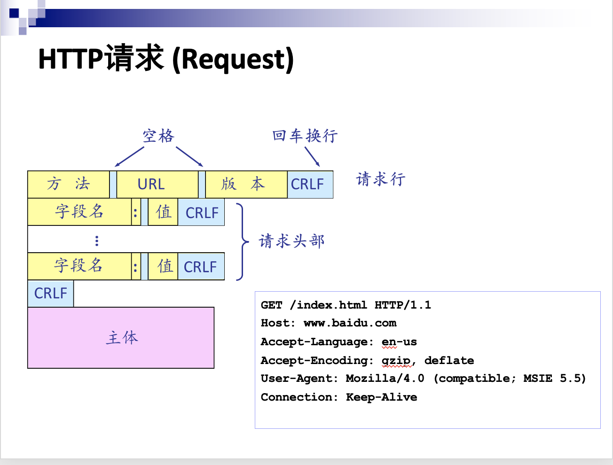
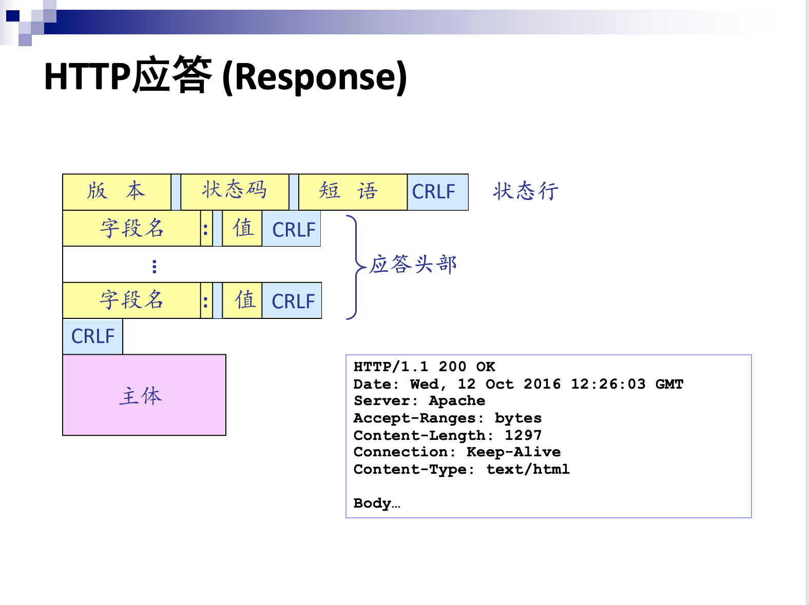

# ucas_computer_network_2022_spring

## Lab2:

Socket using. We use socket API to realize a http server. We only support the **GET** method.  The return codes are as below:

| 状态码                | 描述                                                         |
| --------------------- | ------------------------------------------------------------ |
| 200 OK                | 443端口的请求，如果有文件则返回这个状态码                    |
| 301 Moved Permanently | 80端口的请求返回这个状态码，在应答中用Location字段表示相应的https的url |
| 206 Pratial Content   | 443端口的请求，如果有Range: 返回该状态码                     |
| 404 Not Found         | 443端口的请求，如果找不到对应文件，返回该状态码              |

The structure of the http send frame and receive frame:

And we use **chunked** transmission.

